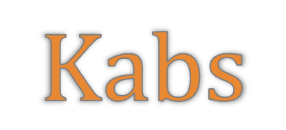
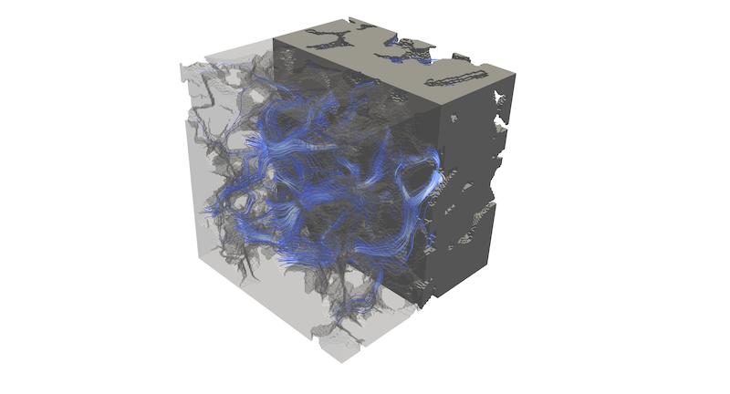

[](https://github.com/PMEAL/kabs/actions/workflows/tests.yml)
[](https://codecov.io/gh/PMEAL/kabs)


`kabs` computes the absolute (Darcy) permeability of a porous material from its 3D tomographic image using the Lattice Boltzmann Method (LBM). Given a binary voxel image of the pore space, it solves single-phase incompressible creeping flow, returning results in lattice units or physical units.



The LBM implementation is adapted from
[Taichi-LBM3D](https://github.com/yjhp1016/taichi_LBM3D)
([DOI](https://doi.org/10.3390/fluids7080270)) by Jianhui Yang.

---

## Installation

```bash
git clone https://github.com/PMEAL/kabs.git
cd kabs
pip install -e .
```

Key dependencies: `taichi` (GPU/CPU acceleration), `numpy`, `pyevtk`.
Optional: `porespy` (used in the examples below to generate synthetic images).

---

## Quick start

```python
import taichi as ti
import porespy as ps
from kabs import solve_flow, compute_permeability

ti.init(arch=ti.cpu)  # use ti.gpu for GPU acceleration

# Generate a synthetic test image (1 = pore, 0 = solid)
im = ps.generators.cylinders([200, 200, 200], r=10, porosity=0.7).astype(int)

# Run the LBM simulation and get a FlowResult back
result = solve_flow(im, direction="x")

# Optionally save to a VTR file for later inspection
result.export_to_vtk("sample")

# Compute permeability directly from the FlowResult
results = compute_permeability(result)
print(f"k = {results['k_lu']:.4e} voxels²")
```

---

## Common usage patterns

### GPU acceleration

Taichi supports CUDA, Metal, and Vulkan backends.  Switch by changing `ti.init`:

```python
ti.init(arch=ti.gpu)   # picks the best available GPU backend
ti.init(arch=ti.cuda)  # CUDA explicitly
```

### Physical units

Pass the voxel size `dx_m` (in metres) to `compute_permeability` to get results in
m² and milliDarcy:

```python
result = solve_flow(im, direction="x")
results = compute_permeability(
    result,
    dx_m=2.85e-6,   # 2.85-micron voxels, typical for micro-CT
)
print(f"k = {results['k_mD']:.2f} mD")
print(f"k = {results['k_m2']:.4e} m²")
```

### Convergence

By default `solve_flow` stops early once the velocity field has converged to within a
relative tolerance of 1e-3 (i.e. `delta|v| / |v| < 1e-3`).  The actual number of
steps run is printed and reflected in the auto-generated VTR filename.

```python
# Tighten or loosen the tolerance
result = solve_flow(im, direction="x", tol=1e-4)  # tighter
result = solve_flow(im, direction="x", tol=1e-2)  # faster, coarser

# Disable early stopping and always run n_steps
result = solve_flow(im, direction="x", n_steps=5000, tol=None)
compute_permeability(result)
```

The convergence check fires every `log_every` steps (default 500), so the true stopping
point is rounded to that interval.

To save the converged result to a VTR file, call `export_to_vtk` on the returned object:

```python
result = solve_flow(im, direction="x", tol=1e-4)
result.export_to_vtk("sample")  # writes sample-<step>-x.vtr
```

### Full permeability tensor

For anisotropic materials, run all three directions:

```python
results = {}
for ax in ("x", "y", "z"):
    result = solve_flow(im, direction=ax)
    results[ax] = compute_permeability(result, dx_m=2.85e-6)

print(f"Kx={results['x']['k_mD']:.2f}  Ky={results['y']['k_mD']:.2f}  Kz={results['z']['k_mD']:.2f}  mD")
```

### Loading results from a VTR file

`solve_flow` returns a `FlowResult` you can use immediately, but if you have a
previously saved `.vtr` file you can reload it with `read_flow_vtr`:

```python
from kabs import read_flow_vtr, compute_permeability

result = read_flow_vtr("sample-1000-x.vtr")
results = compute_permeability(result, dx_m=2.85e-6)
```

### Storage layouts

Choose the field layout based on image size and solid fraction:

- `dense` (the default) is fastest for small images, but its monolithic Taichi
  fields are subject to a signed 32-bit index-stride limit.
- `tiled` uses pointer-backed dense tiles and activates every tile intersecting
  the image. It avoids the monolithic stride limit, but does not reduce storage
  for a fully porous volume.
- `sparse` uses the same tiled hierarchy but activates only tiles containing at
  least one pore voxel, which is useful for mostly-solid images.

```python
result = solve_flow(im, direction="x", storage="tiled", tile_size=16)
result = solve_flow(im, direction="x", storage="sparse", tile_size=(8, 8, 16))
```

The older `sparse=True` option remains an alias for `storage="sparse"`.
Tiles at the image edge are padded internally; padded cells are treated as solid
and are never returned. Tiling removes the Taichi indexing limit, not the memory
cost: a fully porous 900³ D3Q19 simulation needs well over 100 GB for the two
distribution fields alone.

## Return values (permeability)

`compute_permeability` returns a dict:

| Key        | Description                                      |
|------------|--------------------------------------------------|
| `porosity` | Pore volume fraction (dimensionless)             |
| `u_darcy`  | Darcy (superficial) velocity [lattice units]     |
| `u_pore`   | Mean pore-space velocity [lattice units]         |
| `k_lu`     | Permeability in lattice units (voxels²)          |
| `k_m2`     | Permeability in m²  (`None` if `dx_m` not given) |
| `k_mD`     | Permeability in milliDarcy (`None` if no `dx_m`) |

---

## How it works

1. A pressure-driven flow is imposed by fixing density (ρ_in = 1.00, ρ_out = 0.99) on
   opposite faces of the domain along the chosen axis; the other four faces are periodic.
2. The D3Q19 MRT-LBM collision operator evolves the distribution functions to steady
   state.  Solid voxels use bounce-back boundary conditions.
3. Darcy's law is applied to the converged velocity field:

   **K = u_D · μ / |∇P|**

   where u_D is the volume-averaged (Darcy) velocity and |∇P| = Δρ · c_s² / L with
   c_s² = 1/3 for D3Q19.

4. The result in lattice units is scaled to m² (or milliDarcy) using the physical
   voxel size dx_m.

